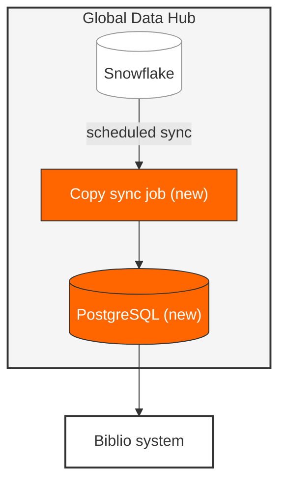

# Confluence mechanics

How to use the platform so a page renders, stays navigable, and survives being edited by someone else.

## Page title and headings

Confluence renders the page title above the body. Do not repeat it as an `H1` inside the body: the reader sees the same words twice and the outline gains a spurious level.

Start the body at `H2` and go down from there. Do not skip levels.

Titles are sentence case like every other heading, and they are what people see in search results and breadcrumbs, so they should name the thing rather than describe the document. "Writing Dagster pipelines", not "Documentation for how to write pipelines using Dagster".

## The metadata block

Design docs and solution overviews open with a short block before the first heading:

```
**Status:** Draft
**Created:** 2026-01-23
**Authors:** Jim Bob
```

`Status` is one of Draft, In review, Approved, or Superseded. If Superseded, link the page that replaced it. Dates are `YYYY-MM-DD`.

## Table of contents

Use the **Table of Contents macro**. It builds itself from the headings and stays correct when someone adds a section.

Never hand-write one. A page on this wiki has a hand-written contents list where all fourteen entries link to `#`, so not one of them works. That is what hand-written navigation decays into.

## Code blocks

Every code block declares its language. Confluence highlights `py`, `sql`, `json`, `yaml`, `bash`, `typescript`, `toml`, and more. An untagged block renders as grey text and loses the highlighting that makes it readable.

Examples must be complete enough to run or to copy. A fragment that references an undefined variable costs the reader more time than no example at all.

Long output, full config files, and anything over about forty lines goes in an **Expand macro** so it doesn't push the rest of the page below the fold.

## Diagrams

Fence every diagram as ` ```mermaid `. A bare fence is not tagged as a diagram at all, and one page on this wiki has both, so its two architecture diagrams are inconsistent with each other.

The house palette is monochrome, with Penguin orange for anything the change introduces. A reader should be able to see what is new at a glance without reading a legend.

| Element | Style |
|---------|-------|
| Outermost container | `fill:#f5f5f5,stroke:#333,stroke-width:2px` |
| Nested container | `fill:#e8e8e8,stroke:#666,stroke-width:2px` |
| Inner group | `fill:#fff,stroke:#999,stroke-width:1px` |
| **New component** | `fill:#ff6600,stroke:#333,color:#fff` |
| External system | `fill:#fff,stroke:#333,stroke-width:2px` |



Keep the `%%` comments. They tell the next editor which colour means what.

Label every edge that carries a meaning: `-->|"scheduled sync"|` rather than a bare arrow.

## Panels and notices

Confluence panels map onto the four notice types:

| Panel | Use for |
|-------|---------|
| Info | Useful but not required to succeed |
| Note | An aside the reader can skip without harm |
| Warning | Don't do this, or this cannot be undone |
| Error | Reserve for genuine failure states in runbooks |

Two rules. **Never put something the reader needs in a panel.** A prerequisite, a required step, or a cross-reference belongs in the flow of the page; readers skim panels. And **use them sparingly**: once a page has five, they stop standing out and become decoration. If a page needs that many, the content wants reorganising instead.

## Tables

Header rows name the column in the reader's terms: `What you'll learn`, `Rationale`, `Plain English`. Not `Column 1`, not `Description` when something more specific is available.

Keep cells to a phrase or a sentence. A cell that needs a paragraph is content that wants to be prose with a heading.

Tables do not scroll well on a narrow screen. Beyond about five columns, use a description list or split the table.

## Links

Descriptive text, always. `[Deploying a code location]`, never `[here]` and never a bare URL.

Link to other Confluence pages with the full URL including the title slug, so the link is readable in the source and still resolves if the title changes:

```
[Alerting](https://prh-uk.atlassian.net/wiki/spaces/BB/pages/4805394628/Alerting)
```

Link to a Jira issue by key and let Confluence render the lozenge, which keeps the status live.

## Multi-page guides

A guide that outgrows one page becomes a hub page with numbered children:

```
Writing Dagster Pipelines            <- hub
  00 - How a Pipeline Fits Together
  01 - Setting Up Your Project
  02 - Designing Your Pipeline
```

The number prefix forces the order in the sidebar, which otherwise sorts alphabetically.

The hub page carries three things: what the guide is for and who it is for, an explicit statement of what it does not cover with a link to what does, and a table of the children:

| Page | What you'll learn |
|------|-------------------|
| 00 - How a pipeline fits together | The building blocks and how they connect |
| 01 - Setting up your project | Why your logic stays in a library, the two-package pattern |

End the hub with a "Where to start" line pointing at the first page, so a reader who has read this far knows what to click.

## Labels

Label every page so it can be found without knowing where it lives. At minimum a project label (`plainview`, `zembla`) and a type label (`design-doc`, `how-to`, `runbook`, `solution-overview`).
