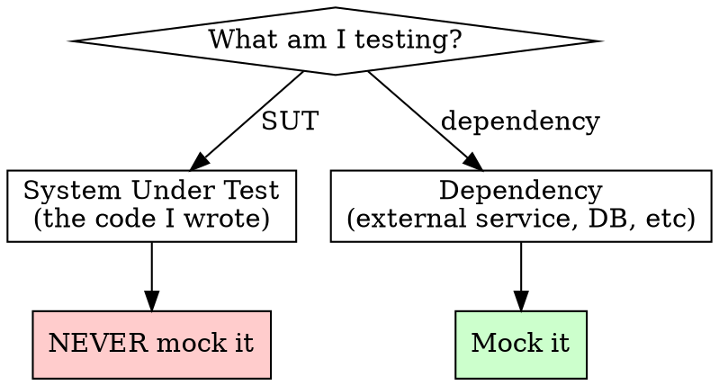
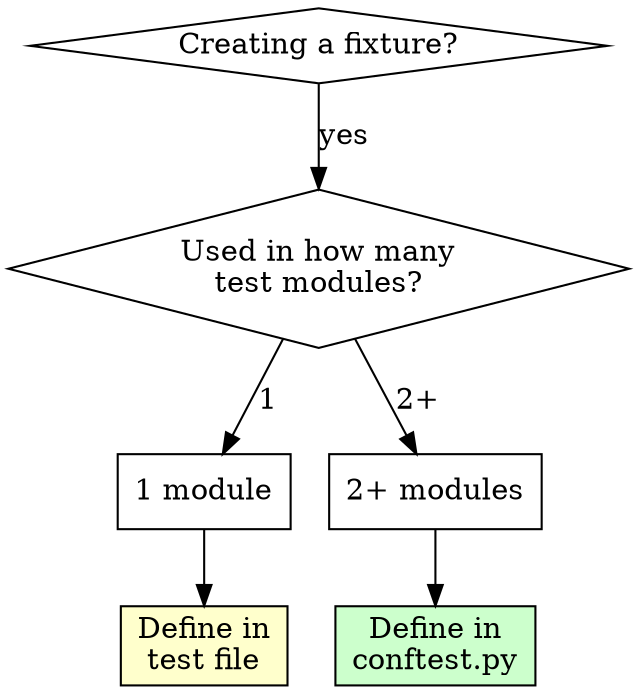

# Python Test Quality Standards

## Overview

Tests verify **invariants**, not the existence of bugs. Write tests that describe what the system **should always do**, not tests that merely exercise code paths.

**Core principle:** Mock dependencies, never mock the system under test. Test behaviors, not implementation details.

## When to Use

**Auto-trigger when:**
- Creating new test files (`test_*.py` or `*_test.py`)
- Modifying existing tests
- Adding pytest fixtures
- Writing mocks or test doubles

**Manual trigger:** `/python-test-quality` for test review

**TDD workflow:** When user requests "test-driven development" or "TDD", load @tdd-workflow.md for the full RED-GREEN-REFACTOR cycle with feature planning.

## Pre-Flight Checklist

**IMPORTANT: Use `TaskCreate` to track EACH item below when writing tests.**

Before writing any test code:

- [ ] Read `conftest.py` for existing fixtures
- [ ] Identify the system under test (SUT)
- [ ] List dependencies to mock (NOT the SUT)
- [ ] Determine invariants to verify
- [ ] Check if Hypothesis applies (pure functions, data transformations)

## The Iron Laws

```
1. ALL imports at module level - NEVER inside functions
2. Mock DEPENDENCIES, never mock the SUT
3. Fixtures used in 2+ modules go in conftest.py
4. Test BEHAVIORS ("when X happens, Y results"), not implementation
5. Use Hypothesis for functions with clear input/output invariants
```

## Import Structure

```python
# ✅ CORRECT: All imports at top
"""Tests for user authentication."""

import pytest
from unittest.mock import AsyncMock, MagicMock
from hypothesis import given, strategies as st

from myapp.auth import Authenticator
from myapp.errors import AuthenticationError


def test_valid_credentials_return_token():
    ...
```

```python
# ❌ WRONG: Function-level imports
def test_valid_credentials_return_token():
    from myapp.auth import Authenticator  # NEVER DO THIS
    ...
```

**Why:** Function-level imports hide dependencies, slow down test discovery, and make refactoring harder.

## Mocking Strategy



### What to Mock

| Mock | Don't Mock |
|------|-----------|
| HTTP clients (httpx, requests) | The class/function being tested |
| Database connections | Internal methods of SUT |
| External APIs | Standard library |
| File system (when slow) | Pure functions |
| Time/randomness | Data structures |

### Mocking Anti-Patterns

```python
# ❌ WRONG: Mocking the SUT
def test_processor():
    processor = MagicMock()  # Testing a mock!
    processor.process.return_value = "result"
    assert processor.process() == "result"  # Proves nothing

# ✅ CORRECT: Mock dependencies, test real SUT
def test_processor(httpx_mock):
    httpx_mock.add_response(json={"data": "value"})
    processor = DataProcessor(client=httpx.AsyncClient())
    result = await processor.process()
    assert result.data == "value"
```

## Fixture Management

### Check conftest.py First

Before creating any fixture:

1. Read the project's `conftest.py` files
2. Check if a suitable fixture exists
3. Check if an existing fixture can be parameterized

### Fixture Placement Rules



### Fixture Examples

```python
# conftest.py - shared fixtures
@pytest.fixture
def valid_jwt_token():
    """JWT token valid for 1 hour from now."""
    return make_jwt_token(exp=time.time() + 3600)

@pytest.fixture
def authenticated_client(valid_jwt_token):
    """API client with valid authentication."""
    client = APIClient(api_key="test")
    client._set_token(valid_jwt_token)
    return client
```

## Behavior-Focused Tests

### Test Names

Name tests after behavior, not methods:

```python
# ❌ WRONG: Named after method
def test_validate():
    ...

# ❌ WRONG: Named after scenario without behavior
def test_empty_input():
    ...

# ✅ CORRECT: Named after behavior
def test_rejects_empty_email():
    ...

def test_retries_failed_requests_three_times():
    ...

def test_returns_cached_result_on_second_call():
    ...
```

### Test Structure

```python
def test_expired_token_triggers_reauth():
    """Expired tokens cause automatic re-authentication."""
    # Arrange - set up preconditions
    client = APIClient(api_key="test")
    client._set_token(make_expired_token())

    # Act - perform the behavior
    response = await client.get("/resource")

    # Assert - verify the outcome (invariant)
    assert client._token.is_expired is False  # Got new token
    assert response.status_code == 200
```

## Characterization Tests

### When to write them

Before refactoring a function that other code depends on, pin the exact output of the functions you're about to change. These tests don't assert correct behavior - they assert **current behavior**. If a refactor accidentally changes output, the pinning test catches it. Delete or update them once the refactor is verified.

Use characterization tests when:
- You're about to refactor a function that other code depends on
- The function's "correct" behavior is defined by what it currently does (no spec)
- The function produces structured output (SQL fragments, file paths, config strings)

### Structure

One parametrized test that covers every input combination, asserting exact string/value equality:

```python
class TestGetTableOutputs:
    """Pin exact fully-qualified table names before refactoring."""

    @pytest.mark.parametrize(
        ("table", "environment", "expected"),
        [
            (Table.EDITION, None, "dsa_dev.equitan.edition"),
            (Table.APLUS_APPROVED, Environment.DEV, "dsa_dev.aplus_dev.aplus_approved"),
            (Table.APLUS_APPROVED, Environment.PROD, "dsa_dev.aplus_prod.aplus_approved"),
            # ... every combination
        ],
    )
    def test_get_table_output(self, table, environment, expected):
        assert get_table(table, environment) == expected
```

### Key points

- Name the test class `Test<Function>Outputs` to signal it's a pinning test, not a behavior spec
- Cover every enum member / input variant - exhaustiveness is the point
- These are **temporary scaffolding** for a refactor, not permanent behavior tests. Add a docstring saying so.

## Hypothesis Integration

### When to Use Hypothesis

Use for functions with:
- Clear input → output relationship
- Mathematical properties (commutativity, associativity)
- Parsing/serialization (roundtrip)
- Data transformations

### Examples

```python
from hypothesis import given, strategies as st

# Roundtrip property
@given(st.text())
def test_json_roundtrip(s):
    """JSON encode/decode preserves string content."""
    encoded = json.dumps(s)
    decoded = json.loads(encoded)
    assert decoded == s

# Invariant property
@given(st.lists(st.integers()))
def test_sort_preserves_elements(lst):
    """Sorting doesn't add or remove elements."""
    sorted_lst = sorted(lst)
    assert len(sorted_lst) == len(lst)
    assert set(sorted_lst) == set(lst)

# Domain property
@given(st.emails())
def test_valid_emails_parse_successfully(email):
    """All valid email formats should parse."""
    result = parse_email(email)
    assert result.is_valid
```

### When NOT to Use Hypothesis

- Integration tests with external services
- Tests requiring specific fixture data
- UI/browser tests
- Tests where setup is expensive

## Coverage Measurement

Run tests with coverage:

```bash
uv run pytest --cov=mypackage --cov-report=term-missing
```

**Coverage helps identify:**
- Untested code paths
- Dead code
- Missing error handling tests

**Coverage does NOT guarantee:**
- Tests are meaningful
- Edge cases are covered
- Behaviors are verified

## Red Flags - STOP and Fix

- [ ] Import statement inside a test function
- [ ] `MagicMock()` on the class being tested
- [ ] Fixture duplicated across test files
- [ ] Test name describes implementation (`test_calls_api`)
- [ ] Test passes when implementation is wrong
- [ ] No assertions or only `assert True`
- [ ] Mocking standard library functions

**All of these mean: Rewrite the test.**

## Common Rationalizations

| Excuse | Reality |
|--------|---------|
| "Import inside function scopes it" | All imports are module-level in production code. Tests follow same rules. |
| "Mocking SUT is faster" | You're testing the mock, not your code. Test proves nothing. |
| "Hypothesis is overkill" | For pure functions, it finds edge cases you won't think of. |
| "Coverage is just a number" | True, but 0% coverage means 0 tests. Measure to identify gaps. |
| "Fixture is only slightly different" | Parameterize the existing fixture instead of duplicating. |
| "Test name is clear enough" | `test_process` tells nothing. `test_rejects_malformed_input` is clear. |

## Quick Reference

| Aspect | Standard |
|--------|----------|
| Imports | Module-level only |
| Mocking | Dependencies only, never SUT |
| Fixtures | conftest.py if used in 2+ modules |
| Naming | `test_<behavior>` |
| Coverage | Always measure with `--cov` |
| Properties | Hypothesis for pure functions |
| Structure | Arrange-Act-Assert |

## Verification Checklist

Before marking tests complete:

- [ ] All imports at module level
- [ ] No mocks on the system under test
- [ ] Checked conftest.py for existing fixtures
- [ ] New shared fixtures added to conftest.py
- [ ] Test names describe behaviors
- [ ] Hypothesis used where appropriate
- [ ] Coverage measured and reviewed
- [ ] Tests fail when implementation is broken
 