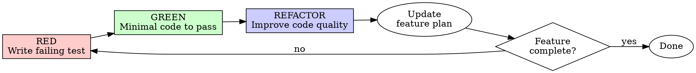

# Test-driven development workflow

**Complements:** superpowers:test-driven-development (core TDD principles)

## Overview

This workflow adds **feature planning** and **living documentation** to core TDD. Before writing tests, understand the feature deeply. Document as you go.

**Your notes file is your long-term memory.** Update it continuously with decisions, discoveries, and answers.

## Phase 0: Feature Planning

### Create Feature Plan

```bash
# Auto-create folder if missing
mkdir -p docs/features
```

**Filename:** `docs/features/YYYY-MM-DD-feature-name.md`

### Template

```markdown
# Feature: [Name]

Created: YYYY-MM-DD
Status: Planning | In Progress | Complete

## Requirements

### Must Have
- [ ] Requirement 1
- [ ] Requirement 2

### Nice to Have
- [ ] Optional requirement

## Open Questions

- [ ] Question needing answer?
  - **Answer:** (filled in when answered)

## Decisions Log

| Date | Decision | Rationale |
|------|----------|-----------|
| | | |

## Implementation Notes

### Discoveries
<!-- Things learned during implementation -->

### Assumptions
<!-- Assumptions made, to be validated -->

## Tasks

- [ ] Task 1 (RED)
- [ ] Task 1 (GREEN)
- [ ] Task 1 (REFACTOR)
- [ ] Task 2 (RED)
...
```

### Ask Clarifying Questions (Progressive)

**Initial questions (before any tests):**
- What problem does this solve?
- What are the inputs and outputs?
- What are the error cases?
- Are there existing patterns to follow?

**Document answers in the feature plan immediately.**

**Progressive questions (during implementation):**
- When unknowns surface, ask
- When assumptions need validation, ask
- Document all answers in the plan

## The Red-Green-Refactor Cycle



### RED Phase

**Goal:** Write a failing test that enforces new desired behavior.

**Rules:**
- Write ONE test for ONE behavior
- Test MUST fail (proves it tests something real)
- Do NOT modify non-test code
- Do NOT write implementation

```python
# RED: Test doesn't pass yet - function doesn't exist
def test_validates_email_format():
    """Invalid emails should raise ValidationError."""
    with pytest.raises(ValidationError):
        validate_email("not-an-email")
```

**Update feature plan:**
- Mark task as "RED complete"
- Note any discoveries or questions

### GREEN Phase

**Goal:** Write the simplest code that makes the test pass.

**Rules:**
- Write MINIMUM code to pass
- Do NOT modify tests
- Do NOT optimize or refactor
- Do NOT add features beyond the test

```python
# GREEN: Simplest implementation
def validate_email(email: str) -> None:
    if "@" not in email:
        raise ValidationError("Invalid email")
```

**Update feature plan:**
- Mark task as "GREEN complete"
- Note implementation decisions

### REFACTOR Phase

**Goal:** Improve code quality while keeping tests green.

**Rules:**
- Tests MUST stay passing
- Improve organization, readability, maintainability
- Apply to new code AND surrounding code
- Leave codebase better than you found it

**Martin Fowler's guidance:**
- Extract methods for clarity
- Rename for intent
- Remove duplication
- Simplify conditionals

```python
# REFACTOR: Improved implementation
import re

EMAIL_PATTERN = re.compile(r"^[^@]+@[^@]+\.[^@]+$")

def validate_email(email: str) -> None:
    """Validate email format.

    Raises:
        ValidationError: If email format is invalid.
    """
    if not EMAIL_PATTERN.match(email):
        raise ValidationError(f"Invalid email format: {email}")
```

**Update feature plan:**
- Mark task as "REFACTOR complete"
- Note refactoring decisions
- Identify technical debt addressed

## Continuous Documentation

**Update the feature plan after EVERY:**
- Question answered
- Decision made
- Discovery during implementation
- Assumption validated or invalidated
- Task completed

**Keep notes brief but useful.** Delete outdated content. Reorganize as understanding evolves.

### Example Updates

```markdown
## Discoveries

- Email validation needs to handle unicode domains (discovered in GREEN)
- Existing `utils.py` has similar validation - consider consolidating (REFACTOR opportunity)

## Decisions Log

| Date | Decision | Rationale |
|------|----------|-----------|
| 2024-01-15 | Use regex not library | Simple case, no need for dependency |
| 2024-01-15 | ValidationError not ValueError | Consistent with existing error hierarchy |
```

## Workflow Checklist

**Before starting:**
- [ ] Create feature plan in `docs/features/YYYY-MM-DD-feature-name.md`
- [ ] Ask initial clarifying questions
- [ ] Document requirements and tasks

**Each RED-GREEN-REFACTOR cycle:**
- [ ] RED: Write failing test (no implementation changes)
- [ ] Verify test fails for expected reason
- [ ] GREEN: Write minimal passing code (no test changes)
- [ ] Verify all tests pass
- [ ] REFACTOR: Improve code quality
- [ ] Verify tests still pass
- [ ] Update feature plan with notes

**After completion:**
- [ ] All tasks complete
- [ ] Feature plan updated with final status
- [ ] Coverage measured
- [ ] Plan can serve as feature documentation

## Quick Reference

| Phase | Do | Don't |
|-------|-----|-------|
| RED | Write one failing test | Touch implementation code |
| GREEN | Write minimal passing code | Modify tests, over-engineer |
| REFACTOR | Improve code quality | Break tests, add features |
| Always | Update feature plan | Skip documentation |

## Common Mistakes

| Mistake | Fix |
|---------|-----|
| Writing tests after code | Delete code, start with RED |
| Test passes immediately | Test is wrong or feature exists |
| Multiple behaviors per test | Split into separate tests |
| Refactoring in GREEN | Wait for REFACTOR phase |
| Skipping plan updates | Discipline - update after every cycle |
| Feature plan becomes stale | Delete outdated content, keep current |
 